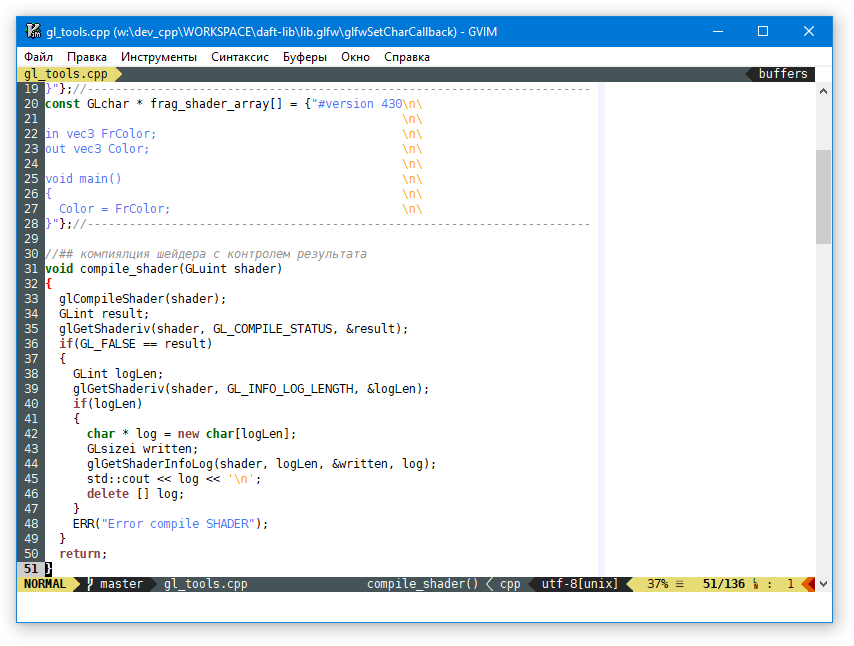

# Пользовательская конфигурация для Vim

## Порядок установки

 - Установить клиент git, Python (используется плагинами) и свежую сборку Vim. (Для платформы "win32" последнюю сборку Vim можно взять тут: https://github.com/vim/vim-win32-installer/releases/latest);
 - Загрузить содержимое репозитория (рекурсивно с подмодулями) в папку "~/.vim" или "%USERPROFILE%\vimfiles" (в зависимости от Вашей платформы);
  - В настройке терминальных программ (putty, cmd, xterminal и т.п.), в которых будет использоваться Vim, выберите TTF шрифт "DejaVu Sans Mono for Powerline".

## Особенности конфигурации

 - Добавлено несколько команд по нажатию (F*) клавиш (см. файл "_keys.vim") для удобства работы в разных языковых раскладках;
 - Подключены плагины для работы с кодом: подсветка, проверка синтаксиса, автодополнение, работа с git (см. "_plugins.vim");
 - Использована светлая тема:

