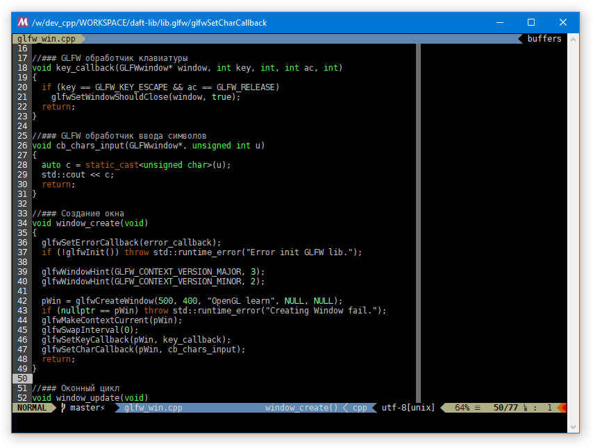

# Пользовательская конфигурация для Vim

## Порядок установки

 - Устанавить Vim (для платформы "win32" последнюю сборку можно взять тут: https://github.com/vim/vim-win32-installer/releases/latest)
 - Загрузить репозиторий в папку "~/.vim" или "%USERPROFILE%/vimfiles"
 - Запустить "assets/install"
 - В настройке терминальных программ, в которых будет использоваться Vim, для вывода символов установите TTF шрифт "DejaVu Sans Mono Bold for Powerline" (он появится в системе после запуска "assets/install").

## Особенности конфигурации

 - Использована тема на основе плагина "vim-airline"
 - Добавлено несколько (F*) клавиш (см. файл "_keys.vim")

